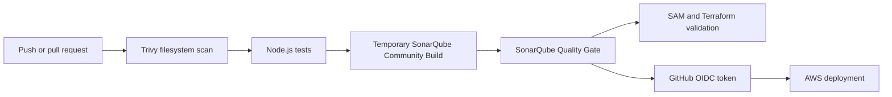

# Automated Security and Code-Quality Controls

## Purpose

Bmazon runs security and code-quality checks before production deployment. The
pipeline does not store AWS access keys or SonarQube credentials in the
repository.

## Pipeline sequence

The CI workflow runs for pull requests and pushes to `main`. The production
workflow runs for pushes to `main` and manual dispatches. Its `deploy` job has a
hard dependency on the `security-and-quality` job, so AWS authentication and
deployment cannot start until all gates pass.

## Trivy

Trivy uses filesystem mode with the `vuln`, `secret`, and `misconfig` scanners.
This covers dependency lockfiles, accidentally committed credentials, and IaC
configuration in the repository. Findings rated HIGH or CRITICAL fail the job;
unfixed upstream vulnerabilities are reported but do not block this student
deployment.

Configuration locations:

- `.github/workflows/ci.yml`
- `.github/workflows/deploy.yml`

## SonarQube Community Build

Each GitHub-hosted runner starts the official pinned Community Build image
`sonarqube:26.7.0.124771-community`. It is bound to `127.0.0.1`, uses its
embedded test database, and is deleted at the end of the job. This avoids a
permanent server and ongoing EC2 cost.

The startup script replaces the default administrator password with a random
value, generates a short-lived analysis token, masks both values in GitHub
logs, and exports the token only to later steps in that runner job. No
SonarQube password or token is committed or saved as a GitHub secret.

`sonar-project.properties` defines the project scope and excludes generated,
vendored, state, evidence, and local build directories. The scanner waits for
the Quality Gate for up to 300 seconds. A failed gate returns a non-zero exit
code and blocks deployment.

Community Build has more limited branch and pull-request features than paid
SonarQube Server editions. A pull-request event still scans the checked-out PR
code in a fresh isolated instance, but this design does not claim persistent
branch history or GitHub PR decoration.

## AWS authentication

Only the production deploy job requests `id-token: write`. It exchanges a
GitHub OIDC token for the `bmazon-github-deploy` IAM role. No long-lived AWS
access key is stored in GitHub. The job uses the protected `production`
environment, and the IAM trust policy is restricted to this repository, the
`main` branch, and the production environment subject.

Application payment secrets remain in AWS Secrets Manager and are retrieved by
the payment Lambda at runtime. They are not passed through GitHub Actions.

## Evidence to capture

For the final report, capture these items from a successful GitHub Actions run:

1. The workflow summary showing the Trivy, tests, and SonarQube steps in green.
2. The Trivy step output showing the scanned target and severity policy.
3. The SonarQube scan log showing `QUALITY GATE STATUS: PASSED`.
4. The SonarQube job summary showing the gate status and open-issue count.
5. The AWS credential step showing OIDC role assumption without displaying any
   credentials.
6. The completed production deploy job and its commit identifier.

Never include token values, Stripe secrets, cookies, authorization headers, or
AWS temporary credentials in screenshots or the final video.
